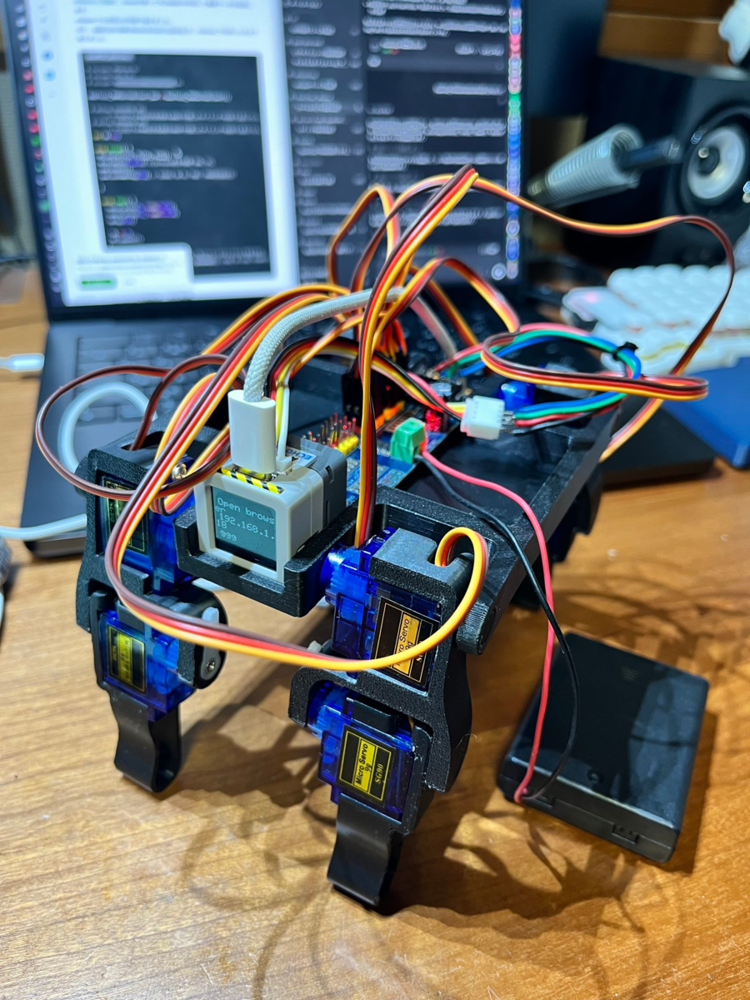
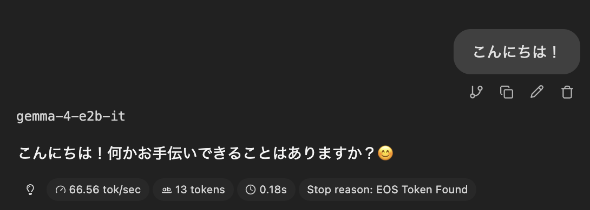

# Stack-Wan-Chan (Atom Dog)

StackChan Minimalをベースにした犬型AIロボを動かすためのプロジェクトです。

M5Stack AtomS3R AI Chatbot キット、PCA9685、8 個の SG90 サーボ、3D プリントした犬型ボディを組み合わせ、ローカル AI サーバーと連携してペットの様に振舞います。



## 概要

AtomS3R 上で動く 4 足歩行 AI ロボットです。

本体側は Wi-Fi、録音、TTS 再生、画面表示、サーボモーションを担当します。音声認識、LLM、音声合成などの重い AI 処理は、PC やスマートフォンなどで起動した外部サーバーに任せる構成です。

## 主な機能

- Wi-Fi 設定ポータル
- AtomS3R 画面への Miro 表情表示
- ローカル Whisper サーバーによる音声認識
- OpenAI 互換 API 経由のローカル LLM 会話
  - llama.cpp
  - LM Studio
  - Ollama
- Piper / piper-plus サーバーによる音声合成
- `walk_only_sample/robot_viewer.html` によるモーション確認・編集 (実験的機能)
- `walk_only_sample/` による PCA9685 + 8 サーボの 4 足歩行テスト (実験的機能)

## ToDo

- 会話に合わせた犬型 4 足ボディのサーボモーション
  - 起き上がり / うなずき / 首振り / アイドル動作
- 会話プログラムとモーションプログラムの統合 (ASAP)

## 部品リスト

| 部品                                                                           | 数量 | メモ                                     |
| ------------------------------------------------------------------------------ | ---: | ---------------------------------------- |
| [ATOMS3R AI Chatbot キット](https://www.switch-science.com/products/10487)     |    1 | AtomS3R と音声ベースの中心部             |
| [PCA9685 16ch PWM サーボドライバ](https://www.switch-science.com/products/961) |    1 | 8 個のサーボを制御                       |
| [マイクロサーボ 9g SG90](https://akizukidenshi.com/catalog/g/g108761/)         |    8 | 4 足分                                   |
| [GROVE 互換ケーブル](https://www.switch-science.com/products/5213)             |    1 | AtomS3R 側との接続用                     |
| [ピンソケット 1x6](https://www.switch-science.com/products/2016)               |    1 | PCA9685 周辺の接続用                     |
| [電池ボックス](https://akizukidenshi.com/catalog/g/g100311/)                   |    1 | サーボ用外部電源                         |
| [GROVE 4 ピンコネクタ](https://www.switch-science.com/products/1122)           |    1 | ケーブル作成用                           |
| [M2x5mm ねじ](https://akizukidenshi.com/catalog/g/g115887/)                    | 適量 | 3D プリント部品とサーボ固定用            |
| 配線ケーブル                                                                   | 適量 | 赤・黒・その他 2 色、AWG24-26 程度を推奨 |

サーボ電源は AtomS3R の USB 給電とは分けてください。PCA9685、サーボ電源、AtomS3R 側の GND は共通にします。

## 印刷する部品

犬型ボディは 3D プリント部品を使います。STL は `hardware/cases/` にあります。

| STL                            | 印刷数 | 用途 |
| ------------------------------ | -----: | ---- |
| `hardware/cases/Body_x1.stl`   |      1 | 胴体 |
| `hardware/cases/Leg_L_x2.stl`  |      2 | 左脚 |
| `hardware/cases/Leg_R_x2.stl`  |      2 | 右脚 |
| `hardware/cases/Foot_L_x2.stl` |      2 | 左足 |
| `hardware/cases/Foot_R_x2.stl` |      2 | 右足 |

印刷後、サーボの向き、ホーンの初期角度、脚の可動範囲を確認してから組み立てます。素材やスライサー設定は手元のプリンタに合わせて調整してください。
PLAを使ってBambu Lab A1を使って印刷しました。

## AI サーバー

このリポジトリには、AI モデル、AI サーバーバイナリ、TTS エンジン、音声モデル、音声ライブラリは含まれていません。

必要に応じて、次のサービスを別途起動してください。

- whisper.cpp: 音声認識
- llama.cpp / LM Studio / Ollama: LLM 会話
- piper-plus: 音声合成
- VOICEVOX 互換アダプター 任意

個人的にはGUIでよしなに操作できるんでLM Studioがおすすめです。モデルは`gemma-4-E2B-it-GGUF/gemma-4-E2B-it-Q4_K_S`を使ってます。
サーバー用のパソコンはMacBook Pro M5 / RAM 24GBです。前述のモデルだと60~Token / secで動くので爆速でレスポンスが帰ってきます。



AtomS3R からは Web 設定画面で各サーバーの IP アドレス、ポート、モデル名などを設定します。

## ビルド

メインファームウェア:

```sh
pio run
```

書き込み:

```sh
pio run --target upload
```

シリアルモニタ:

```sh
pio device monitor
```

現在の `platformio.ini` は AtomS3R / Arduino-ESP32 Core v2 系を前提にしています。サーボ制御を使うため `-DENABLE_SERVO` が有効です。

4 足歩行だけを試す場合は `walk_only_sample/` を使います。

```sh
cd walk_only_sample
pio run
```

`walk_only_sample` は AtomS3R の GROVE/HY2.0-4P 端子から PCA9685 を I2C 接続し、8 個の SG90 を動かす最小テスト兼モーション調整用ファームウェアです。

## 初回起動

1. AtomS3R を起動します。
2. Wi-Fi 未設定の場合は設定用 AP が立ち上がります。
3. 画面に表示される SSID または URL にアクセスします。
4. Wi-Fi と AI サーバー設定を保存します。
5. 再起動後、Miro がネットワーク経由で AI サーバーに接続します。

## サーボについて

PCA9685と8個のSG90で犬型4足ボディを動かします。

`walk_only_sample` の配線:

```text
Atom G                 -> PCA9685 GND
Atom 5V                -> PCA9685 VCC
Atom GROVE white / G1  -> PCA9685 SDA
Atom GROVE yellow / G2 -> PCA9685 SCL

External 5V +          -> PCA9685 V+
External 5V -          -> PCA9685 GND
```

AtomS3R 側 GND、PCA9685 GND、サーボ用外部電源 GND は必ず共通にします。

起動時に短いセルフテストを行い、センター位置、上下、左右の動作を確認します。サーボが動かない場合は、次を確認してください。

- サーボ用電源が接続されているか
- GND が AtomS3R 側と共通になっているか
- PCA9685 の SDA / SCL の配線が正しいか
- サーボの向きと可動範囲が機構に合っているか

サーボは USB 給電だけでは電流が足りないことがあります。安定した外部電源を使ってください。

メインファームウェア側の簡易サーボ機能は GPIO2 / GPIO1 の 2 サーボ制御を前提にしています。4 足歩行の調整や動作確認は `walk_only_sample` を使ってください。

## VOICEVOX TTS 任意

StackChan Minimal Dog Edition は、外部 TTS サーバーとして VOICEVOX 互換アダプターへ接続できます。

本リポジトリには、VOICEVOX、VOICEVOX Engine、VOICEVOX Core、音声モデル、音声ライブラリ、VOICEVOX インストーラーは含まれていません。

VOICEVOX 音声を利用する場合は、ユーザー自身が公式配布元から VOICEVOX を別途インストールし、VOICEVOX ソフトウェア利用規約および各音声ライブラリの利用規約に従ってください。

クレジット表記例:

- VOICEVOX:ずんだもん
- VOICEVOX:四国めたん

StackChan Minimal Dog Edition は、VOICEVOX および各音声ライブラリの権利者による公式製品・公認製品ではありません。

## ライセンス

このプロジェクトは Apache License 2.0 で公開しています。

サードパーティライブラリのライセンスは `third_party_licenses/` を確認してください。
